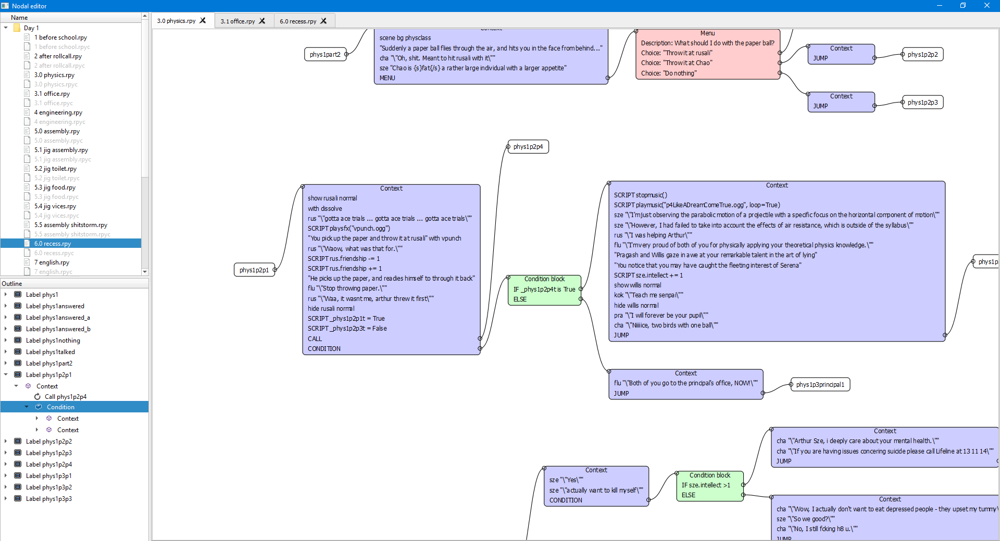
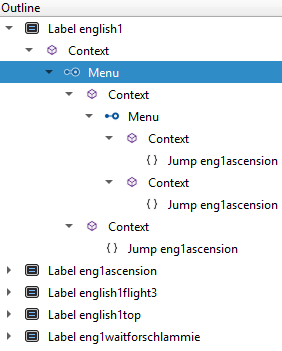
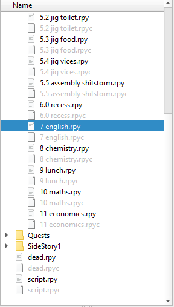

### Node based script editor for Renpy scripts
**Script editor** aims to visualise all dialogue inside a Renpy game in a more intuitive format. 
Instead of reading through a monolithic file that is interspersed with dialogue, conditionals, menus and inline python/Renpy scripts, 
visualise your game as a colourful node graph. 

### Description
Each node is visually distinct from another node to represent a different building block of your Renpy script, and each connection indicates a flow
of execution into another node. Conditional statements and menus will branch off into different nodes to represent a branch in your story.

Another feature is linking between different labels in your script. Renpy scripts use labels to control flow using jump or call directives to start executing
at the label. By doubling clicking on a jump or call node, you will be taken to the corresponding label node, whether it be in the same file or different file.
Files can also be inspected in the node editor from the file explorer as well. This way, you can easily map out the flow and branches of your story in a visually intuitive manner.

### Features
* Panning and zooming of node graph 
* Inspecting files from a file explorer
* Moving between node graphs in different files
* Loading multiple files at once into the editor
* Can represent dialogue, conditionals, menus, and jump/call directives
* Can export the entire graph model as JSON
* Have an outline of panel for each node graph for faster navigation
* Add tabs for multiple files

### Roadmap
* Show jump/call directives associated for each label to see what uses the label
* Add breadcrumb for better navigation
* Add undo and redo when moving between nodes in files
* Add split screen to view two files at once
* Add support for Renpy screens
* Integrate an editor so that the Renpy script can be created using a node graph

### Bugs
* Connections between nodes don't render unless camera is moved to the origin
* Artifacting left behind when cubic connection is moved (Possible bounding rect issue)
  
### Requirements
* Python 3.0 and above
* PySide2 or any Qt5 binding

### Gallery
#### Application

#### Outline panel

#### File explorer

#### File tabs

